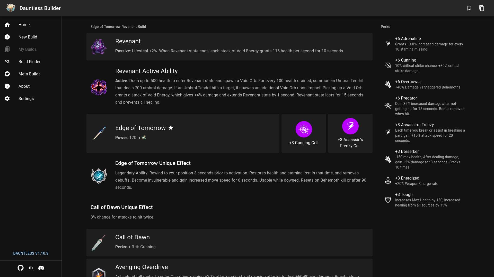

# dauntless-builder

[](https://app.travis-ci.com/atomicptr/dauntless-builder)
[](https://crowdin.com/project/dauntless-builder)

Create and share Dauntless builds with your friends!



## Documentation

-   [Data Documentation](docs/DATA.md) - How data is set up, how to contribute, how to use our data in your application.
-   [Data Deprecations](docs/DEPRECATIONS.md) - Things that have been or will be removed from the public facing data "api"
-   [Localization Documentation](docs/LOCALIZATION.md) - How the translation system works, how to contribute translations etc.

## Localization

We're using Crowdin for managing localizations: https://crowdin.com/project/dauntless-builder

## Development Setup

Requirements:

-   Node.js 16+ (Non LTS versions are generally unsupported)
-   yarn package manager (install via `npm install -g yarn`)

```bash
# Assumption: You have already cloned the repository and are inside the directory
# Install dependencies
$ yarn
# Build dependency data (item data, i18n files, about page stuff, etc.)
$ yarn build:deps
# Run the development environment
$ yarn dev
```

You should now have Dauntless Builder running on your system via http://localhost:3000
(port might be different).

## Notes

### Data changes & the map file

If you change something in data/ make sure to call `yarn build:data` which will update .map/names.json
and include that in your pull request.

### English Language

Because Dauntless is developed by a Canadian company, we decided to use Canadian/British English instead of
American English.

## Contact

If you find an issue or want to provide feedback please use
[Github Issues](https://github.com/atomicptr/dauntless-builder/issues), join the
[Dauntless Builder Discord Server](https://discord.gg/hkMvhsfPjH) or the
[Dauntless Builder Matrix Channel](https://matrix.to/#/#dauntlessbuilder:matrix.org).

## Assets

All Dauntless related assets are the property of Phoenix Labs.

The collected data itself is public domain.

## License

[](<https://tldrlegal.com/license/gnu-affero-general-public-license-v3-(agpl-3.0)>)
